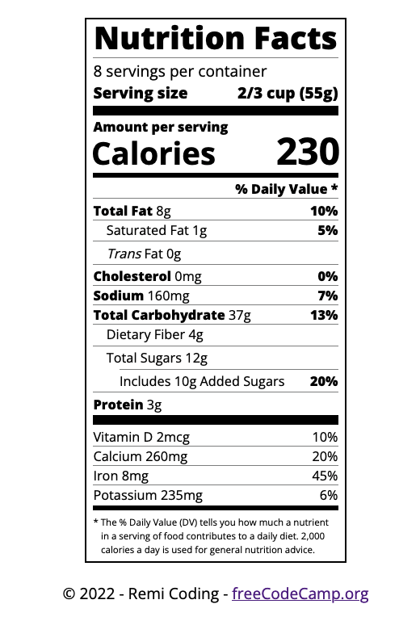

# Nutrition Label Page

This repository contains the HTML and CSS for the **Learn Typography by building a Nutrition Label** course by [freeCodeCamp](https://www.freecodecamp.org/learn/2022/responsive-web-design/).

Typography is the art of styling your text to be easily readable and suit its purpose..

The `index.html` file contains HTML tags and appropriate classes to use for the manipulation of the elements on the page.

The `css/styles.css` file is use in accord with typography methods applied to the properties of classes and elements to build a a nutrition label webpage. CSS is used to to style text, adjust line height, and position text on the webpage to make it appealing.

The page can be viewed here: [Nutrition Label](https://remicoding.github.io/nutrition-label-page/)

For your convenience, here is a screenshot of the page:

